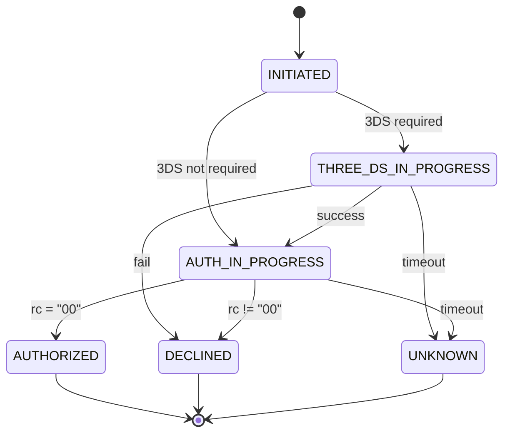

# Transaction State Machine

## Scope

This document defines a conceptual transaction state model for an e-commerce card payment flow.

---

```mermaid
stateDiagram-v2
  [*] --> INITIATED

  INITIATED --> THREE_DS_IN_PROGRESS: 3DS required
  INITIATED --> AUTH_IN_PROGRESS: 3DS not required

  THREE_DS_IN_PROGRESS --> AUTH_IN_PROGRESS: success
  THREE_DS_IN_PROGRESS --> DECLINED: fail
  THREE_DS_IN_PROGRESS --> UNKNOWN: timeout

  AUTH_IN_PROGRESS --> AUTHORIZED: rc = "00"
  AUTH_IN_PROGRESS --> DECLINED: rc != "00"
  AUTH_IN_PROGRESS --> UNKNOWN: timeout

  AUTHORIZED --> [*]
  DECLINED --> [*]
  UNKNOWN --> [*]
```
