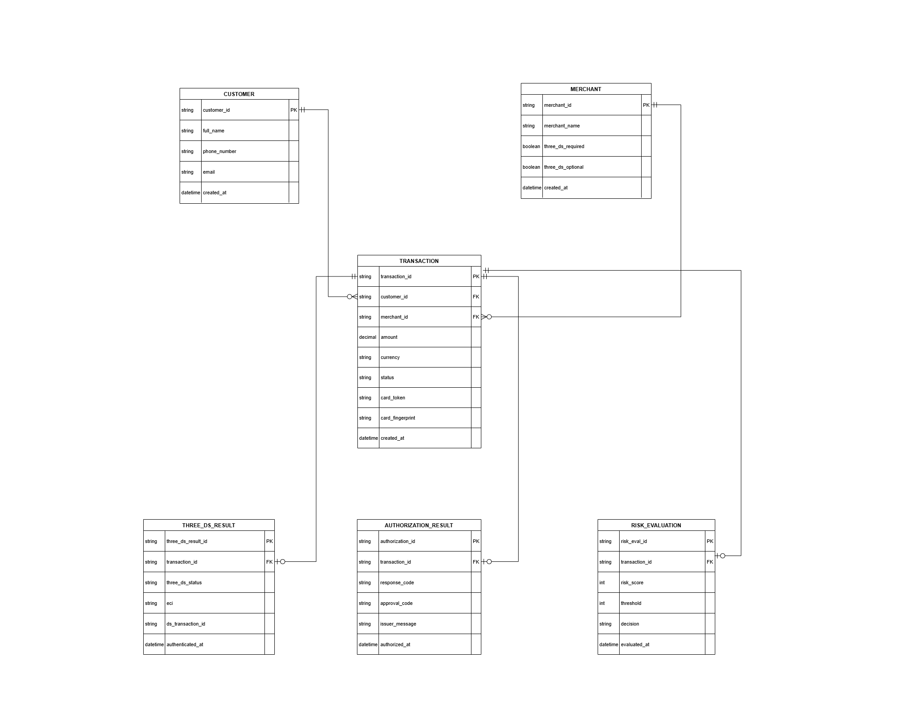

# Simplified ER Model – Card Payment

## Scope
This document presents a conceptual relational data model for a card payment transaction,
covering 3DS authentication, risk evaluation, and authorization stages within a typical
payment processing flow.

The model focuses on transaction lifecycle traceability and separation of responsibility
between authentication, risk, and issuer authorization layers.

---

## ER Diagram

---

## Key Entities

- **Transaction** – Core payment record initiated by a customer
- **Three_DS_Result** – Stores 3DS authentication outcome and related metadata
- **Authorization_Result** – Stores issuer authorization response
- **Risk_Evaluation** – Stores internal fraud/risk decision data

---

## Relationship Overview

- Each **Transaction** may have **0 or 1** Three_DS_Result
- Each **Transaction** may have **0 or 1** Authorization_Result
- Each **Transaction** may have **0 or 1** Risk_Evaluation record
- All supporting tables reference `transaction_id` as a foreign key

To enforce the one-to-one logical relationship, the `transaction_id`
field in supporting tables is assumed to be UNIQUE.

---

## Design Assumptions

- This model assumes a single authorization attempt per transaction.
- Authorization retry scenarios are intentionally excluded for simplification.
- Sensitive card data is assumed to be tokenized or masked.
- Response code "00" represents approval.

---

## Notes

This is a conceptual data model created for demonstration purposes.
It reflects structural separation between authentication, risk assessment,
and authorization layers in modern payment systems.
